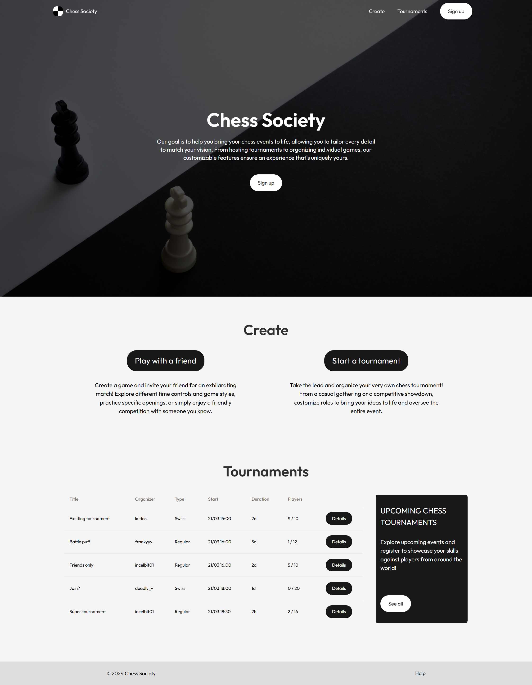
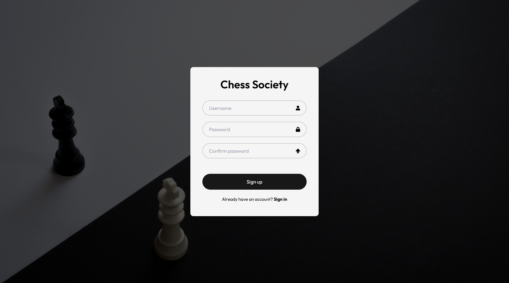
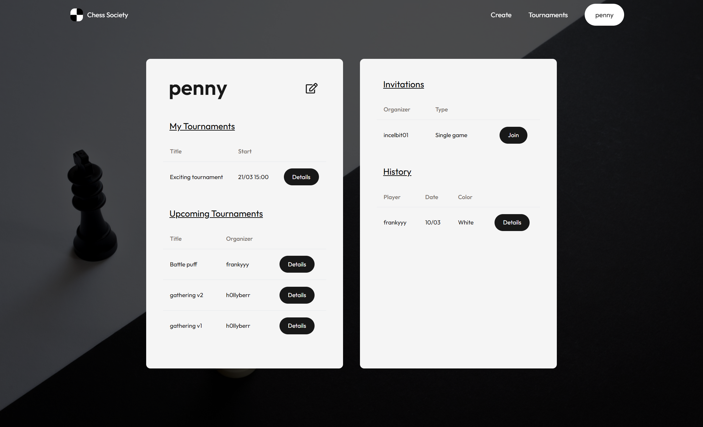
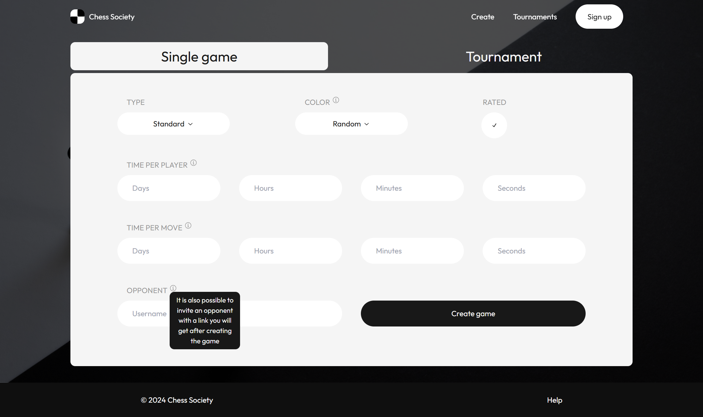
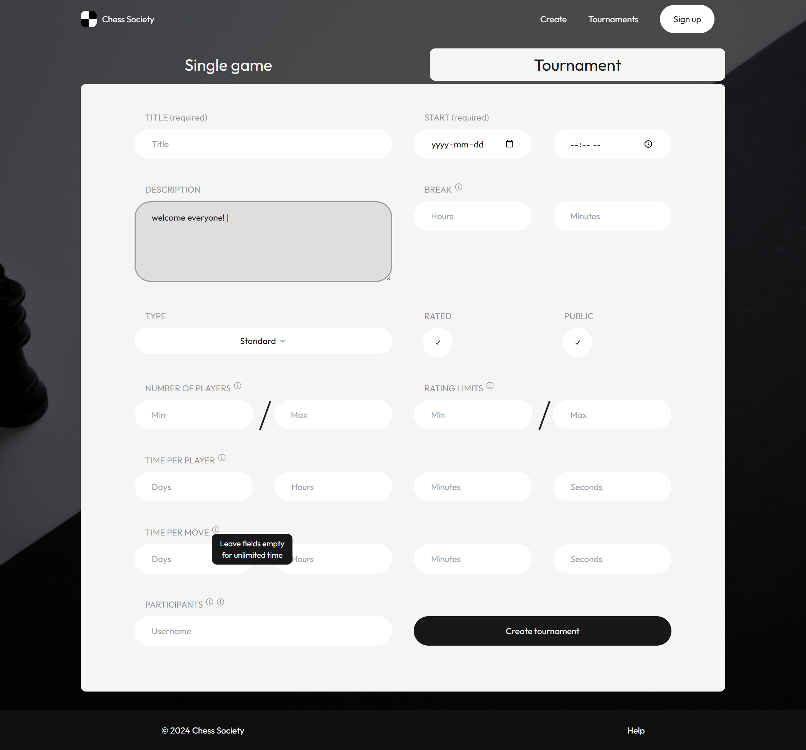
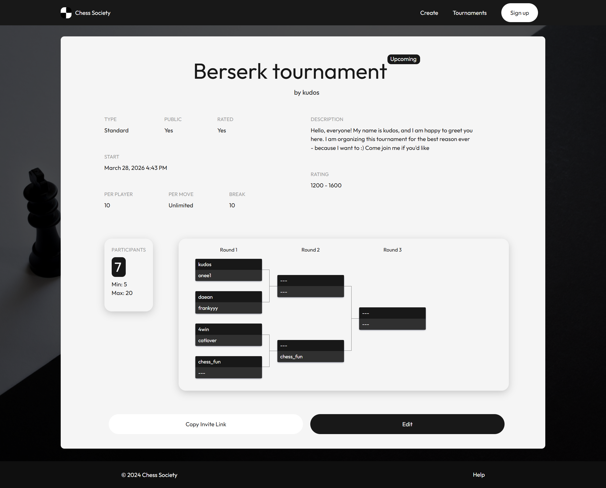
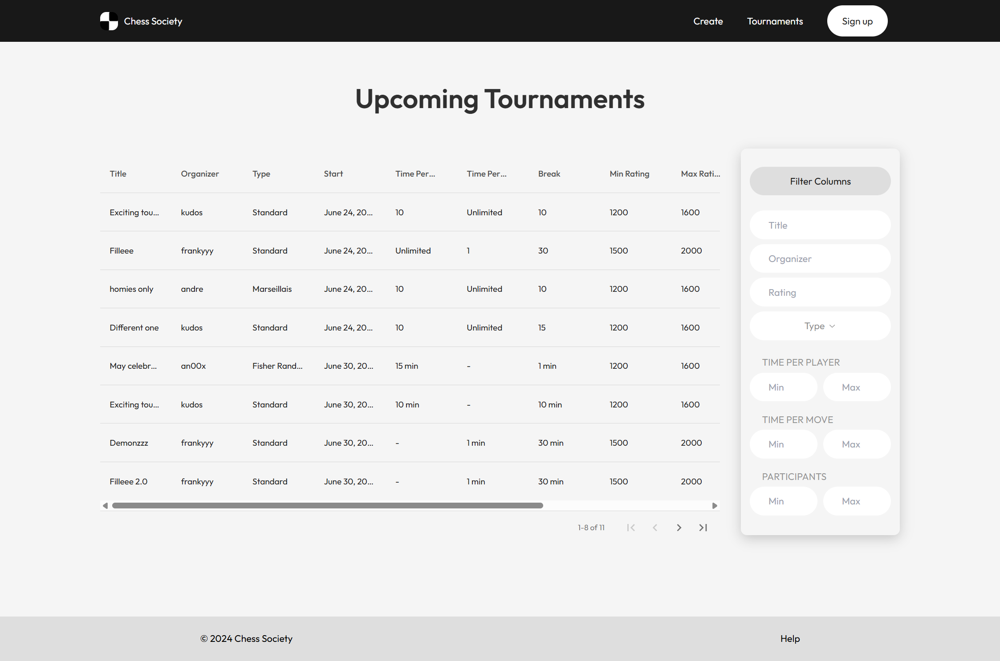

# Chess Society

A frontend prototype for a chess club platform where players can browse and create tournaments or individual games, manage their accounts, and play the game while seeing each other via embedded video stream.


## Features

- **Home page** - hero section, upcoming tournaments preview, quick-create panel
- **Tournaments listing** - sortable, filterable table of all tournaments with rating range, time controls, and participant counts
- **Tournament details** - full tournament info page with bracket visualization
- **Tournament creation** - tabbed form for creating single games or full tournaments, with type, time controls, rating limits, and privacy settings
- **Tournament editing** - pre-filled edit form for existing tournaments
- **Account page** - user profile showing organized and upcoming tournaments
- **Account editing** - form for updating profile info
- **Login & Registration** - auth form pages
- **Game page** (planned) - page where players could play chess while each of them can choose to turn on the video from their camera for the opponent to see them


## Screenshots

<table>
  <tr>
    <td></td>
  </tr>
  <tr>
    <td></td>
    <td></td>
  </tr>
  <tr>
    <td></td>
    <td></td>
  </tr>
  <tr>
    <td></td>
    <td></td>
</table>


## Tech Stack

| Layer | Technology |
|---|---|
| Framework | React 18 + Vite |
| Routing | React Router v6 |
| Styling | Tailwind CSS + plain CSS modules |
| UI primitives | Radix UI (Select, Tabs, Toggle) |
| Tables | React Data Table Component, shadcn/ui Table |
| Bracket visualization | react-brackets |
| Date formatting | Moment.js |
| Icons | Lucide React, React Icons |


## Getting Started

```bash
# Install dependencies
# --legacy-peer-deps is required due to a peer dependency conflict in react-brackets
npm install --legacy-peer-deps

# Start the dev server
npm run dev
```

The app will be available at `http://localhost:5173`.


## Project Structure

```
src/
├── pages/           # Route-level page components
│   ├── home/
│   ├── Login/
│   ├── Registation/
│   ├── Account/
│   ├── create/
│   └── Tournaments/
├── components/      # Feature components (one folder per component)
│   ├── Navbar/
│   ├── Hero/
│   ├── Tournaments/
│   ├── TournamentsPage/
│   ├── TournamentDetailsPage/
│   ├── TournamentEdit/
│   ├── CreatePage/
│   ├── AccountInfo/
│   ├── AccountEditForm/
│   ├── LoginForm/
│   ├── RegistrationForm/
│   ├── Footer/
│   ├── Title/
│   └── Streams/     # Placeholder — not yet implemented
└── assets/          # Images and icons
components/
└── ui/              # Shared shadcn-style primitives (Table, Tabs, Select)
```


## Known Limitations

This is a frontend-only prototype. A few things are intentionally incomplete:

- **No backend** - all data is hardcoded mock data; no API calls are made
- **Auth is UI-only** - login and registration forms exist but do not authenticate
- **Bracket data** - the tournament bracket on the details page uses static placeholder data
- **Game page & video streaming** - designed but not yet implemented
- **Streams section** - a "Watch live streams" feature is stubbed out but also not yet implemented


